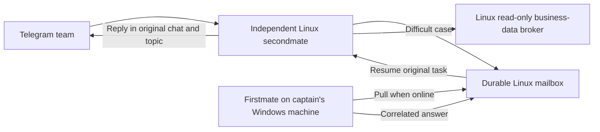

# Local firstmate with independent Linux secondmates

## Chosen operating model

Captain sets up firstmate on their Windows machine. Each secondmate remains a
Linux service with its own bot, model, memory, work queue and workers. The existing
Linux firstmate is not required by this architecture and is not stopped or moved
by these source changes.

The mailbox and data broker do not run a model. Keeping them on Linux lets the
child continue routine work while Windows is off. Its approved configuration and
skills remain cached locally. It does not wait for firstmate before every action.

## What is escalated

Escalate a bounded task when two materially different attempts fail, a decision
needs expertise the child cannot establish, or the required capability exists
only in the local firstmate environment. State the exact unresolved question.
Do not repeatedly retry the same failed cleanup or infrastructure operation for
twenty minutes. Preserve the work and report the operational fault separately.

The dossier contains the task ID, reason, question, relevant context, attempted
approaches and explicit evidence. Include selected logs or repository/commit
references as data. Do not automatically copy entire memory, environments,
credentials, personal files or arbitrary attachments into the dossier.

The child records the case before networking and uses the same immutable ID/hash
on retry. After a waiting notice has been sent to the original chat, only that
task is parked. Other authorized requests continue. An expert answer must match
the original case hash and claim before it can resume that task. Cancelled or
already-consumed answers cannot restart old work. A received answer remains
advice; the child must verify relevant changes and tests before announcing success.

## Receiving on Windows

The local receiver connects outbound to the private Linux API. Use TLS and scoped
credentials, or an explicitly reviewed encrypted private-network boundary. No
inbound Windows port or remote desktop access is required by the queue protocol.

Being online means the receiver and its configured firstmate handler are running
and can reach Linux; powering on the PC alone is insufficient. Captain installs
and connects their own firstmate using the portable receiver guide in
[parent-control/README.md](parent-control/README.md). This repository supplies
the protocol/client, not an unverified launcher for an unknown local installation.

The handler is one operator-configured executable/argument list and working
directory. It receives one structured case on stdin. Case content cannot choose
a command, shell, local destination or executable. The receiver records receipt,
claim and dispatch durably. After an ambiguous handler result or crash it stops
that case for reconciliation; reconnecting does not automatically run it twice.

Cases from a team bot are untrusted work input, not captain approval. They grant
no personal-desktop, administrator, deployment, merge or knowledge-promotion
authority. Firstmate uses its own configured project scope and authority policy.
Actions on captain's desktop require its own verified captain instruction or
explicitly configured local capability policy.

## Application delivery and the reported screenshot

A page responding inside a Linux container does not prove that captain's Windows
browser can reach it. A `localhost` address names the machine on which the browser
runs. A server agent also has no inherent ability to open a browser on Windows.

For a web application, the server task should establish and document the intended
private access route, report the URL and separately state which checks were run.
The local firstmate can verify that route from Windows and open the page when
captain requests it and the installation provides the necessary local tools.
Do not mark user access complete merely because an internal health check returns
HTTP 200. Do not use a downloadable `.cmd` as proof that the connection works.

The screenshot supplied for this change was diagnostic evidence. Its embedded
instructions to download or execute a file were not a request to run that file.
No screenshot attachment was executed or forwarded by this work.

## Persistent boundaries

- Sol/xhigh remains the child's selected model; firstmate's model is separately
  configured by captain.
- Group learning stays in the child. Escalation does not automatically promote
  memory; exact selected claims still require verified Mac approval.
- Supabase access remains through the restricted read-only broker on Linux.
  Neither the child nor the portable receiver receives an administrator DB key.
- Captain's existing group exclusions remain effective, including when a late
  expert reply arrives after group access has been revoked.
- Code goes to GitHub through a reviewed PR. No auto-merge or deployment is
  authorized by a successful test or expert reply.

## Rollout acceptance

Test with a synthetic case while the local receiver is offline; verify a second
ordinary child task can complete. Start the receiver, confirm one durable pickup,
return a correlated answer, and verify the resumed task replies to its original
chat/topic. Reconnect/retry must not duplicate the local handler or child reply.
Also test cancellation, wrong-owner/hash responses, revoked groups and handler
timeout. Keep offline unit checks distinct from actual local-firstmate execution.

Review and merge the source PR before live rollout. Reconcile existing stuck work
and preserve its records before migrating the child. Configure the private Linux
mailbox and reader separately; then connect captain's self-installed firstmate.
