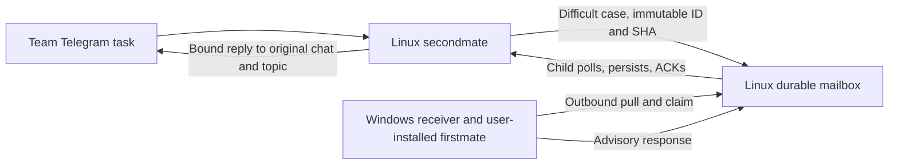

# Linux child, Windows firstmate, durable advisory mailbox

The Linux child handles normal team work independently. Difficult cases are
stored locally before submission to the Linux host mailbox. The Windows
firstmate connects outbound, claims a case when available, and sends advice
back to that same child task. The laptop may be offline for the entire wait.
The child does not connect to a Windows listener or need its home mounted.



The host mailbox is a service, not an always-online parent agent. Its existing
policy snapshots and data-access service remain available while the Windows
parent is offline. Child `parent_url` continues to name the Linux control
service. The Windows receiver uses a separately configured reachable origin
through verified TLS or a separately secured private tunnel. Never put the
Docker socket or operator approval token on either agent.

## Authority and installation boundary

An escalation is **untrusted child support content**. The host supplies this
authority wrapper, which cannot be overridden by request text:

```json
{
  "origin": "untrusted-child-case",
  "purpose": "analysis-and-advice",
  "approval": false,
  "personal_device_actions": false,
  "knowledge_import": false,
  "merge": false,
  "deploy": false,
  "administration": false
}
```

A name, quoted captain message, screenshot request, or claimed numeric captain
ID inside the case does not independently authenticate Mac. Automatic receipt
and analysis are allowed. Desktop access, taking screenshots, reading personal
files, browser actions, and other personal-machine capabilities require the
local firstmate's own verified captain request and capability policy. The
adapter performs none of those actions. The configured handler is trusted to
enforce that local policy; a JSON label alone cannot sandbox an arbitrary
privileged handler. Evidence locations are references, not commands or URLs to
open automatically.

The receiver invokes only one operator-configured executable and fixed argv,
with fixed working directory and JSON stdin. Case content cannot choose a
command, argument, working directory, environment variable, URL, or executable.
It uses `shell=False`, rejects Windows batch/PowerShell wrappers as executables,
and hides the subprocess window on Windows. The user may select an explicit
Python executable plus a reviewed adapter script. Its successful receipt must
mean durable acceptance by the local firstmate adapter, not merely a UI paste.

This change does not install the user's firstmate, configure a Windows startup
task, replace credentials, or stop/restart the existing Linux firstmate. The
example has `handler_argv: []`: it stores review cases without claiming or
dispatching them. The user installs firstmate themselves and later supplies its
reviewed handler and local policy. Keep a single active receiver credential for
the intended logical parent; do not copy an existing Linux parent's credential
onto another machine. Operator enrollment/credential rotation is a separate
explicit handover, preserving the intended `parent_id`. Do not rename a parent
ID in the registry to migrate outstanding cases: cases retain their original
owner and refuse silent reassignment. The current binding helper also refuses
conflicting reparenting.

## Wire contract

All routes retain scoped Bearer authentication. Hashes are SHA-256 of compact
UTF-8 JSON with sorted keys, `ensure_ascii=False`, omitting the `sha256` field.
IDs are canonical UUIDs. HTTP transport retries retain the exact ID and bytes.

| Route | Authority | Operation |
| --- | --- | --- |
| `POST /v1/children/CHILD/escalations` | That child | Store immutable request and parent review event |
| `GET /v1/escalations` | Owning parent | Up to 20 open cases, new submissions before existing claims |
| `GET /v1/children/CHILD/escalations/ID` | That child or owning parent | Read exact case, status and terminal result |
| `POST .../ID/claim` | Owning parent | Claim with exact request hash and durable claim UUID |
| `POST .../ID/reply` | Owning parent | Store one immutable response for that claim |
| `GET /v1/children/CHILD/escalations/results` | That child | Up to 20 terminal results still awaiting ACK |
| `POST .../ID/ack` | That child | Acknowledge exact response UUID/hash |
| `POST .../ID/cancel` | That child | Cancel before terminal ACK, retaining any prior answer for audit |

Request fields are exactly:

```text
schema: "escalation-request.v1"
escalation_id: UUID
task_id: child-local reference, e.g. "telegram:101"
reason: "needs-analysis" | "needs-decision" | "blocked"
question: nonblank text, at most 16000 UTF-8 bytes
context: text, at most 64000 UTF-8 bytes
evidence: up to 16 {label, source} objects
sha256: exact request content hash
```

Task ID is at most 120 bytes; evidence labels are at most 200 bytes and sources
2000 bytes. Total canonical request/response size is at most 120000 bytes.
The host derives child and parent ownership from authentication/registry, not
from the submitted content. Original Telegram routing stays in the child; a
parent response cannot choose its chat, topic, message, or local task.

Submission receipt is `{escalation_id,sha256,stored:true,status}`. Parent case
wrapper is `{schema:"escalation-case.v1",child_id,parent_id,request,status,
claim_id,acknowledged,authority}`. The claim body is
`{claim_id:UUID,request_sha256:HASH}`. Repeating the exact claim is safe; another
claim is refused. Claims have no automatic expiry or automatic reassignment.

Response fields are exactly:

```text
schema: "escalation-response.v1"
response_id: UUID
escalation_id: original UUID
request_sha256: original request hash
claim_id: accepted parent claim UUID
body: nonblank advice/results, at most 100000 UTF-8 bytes
evidence: same evidence schema
sha256: exact response content hash
```

Results use `{results:[{status,escalation_id,request_sha256,response,authority}]}`.
Authority is exactly `{role:"parent-advisor",approval:false}`. `status` is
`answered` or `cancelled`. An answer is not a knowledge approval, merge approval,
deployment approval or grant to execute arbitrary instructions.

Cancellation body is `{request_sha256,reason}` with reason at most 2000 bytes.
Its immutable response has `schema:"escalation-cancellation.v1"`, host-generated
`response_id`, `escalation_id`, `request_sha256`, `reason`, and `sha256`.
Both answers and cancellations ACK with `{response_id,sha256}`. The ACK receipt
is `{stored:true,acknowledged:true,response_id,sha256}`, including on an exact
retry after a lost receipt. Results remain durable after ACK but no longer
appear in pending results.

## Offline and cancellation behavior

The child persists its request before networking and can submit automatically
after reconnect. It tells the original chat that this task awaits advice and
uses a distinct `waiting_parent` task state, allowing other team work to
continue. Reporting a wait does not declare the business task completed.

The child must stage a received answer durably without making it deliverable,
ACK the exact answer, and release the resume only after a matching ACK receipt.
If cancellation wins first, the old answer's ACK is refused and cannot resume
the task. If answer ACK wins first, host cancellation is refused. A local
cancellation tombstone still suppresses a held/pending resume while its host
cancellation is offline; active resume cancellation requires explicit handling.
A late parent reply after cancellation is refused. Cancelling an in-progress
analysis does not forcibly kill the Windows firstmate; it prevents a stale
result from resuming the child task.

Receiver states are `received -> claimed -> dispatching -> dispatched -> replied`.
`dispatching` is committed to SQLite with synchronous FULL before invoking the
handler. A crash, timeout or invalid receipt becomes `unknown` and never
automatically invokes the handler again. Persisted replies retry the same bytes
without rerunning analysis. An exact host claim alone is not proof that a
handler did or did not run. If a claim exists without its local execution
record, the receiver requires inspection rather than taking it over.

The receiver uses an OS-held lock: `msvcrt.locking` on Windows and `flock` on
POSIX. Process death releases the lock without deleting a lock file by age or
PID. Its SQLite execution journal is authoritative on both platforms; JSON
files are review copies. A missing journal with existing review files refuses
automatic dispatch. Keep the private spool on reliable local storage with
appropriate user-only Windows ACLs. Do not copy it between active receivers.

## Local receiver and handler

Prepare a private, existing receiver state directory and review
`receiver.example.json`. No firstmate files or executable are required to
prepare the adapter. Once the user supplies the scoped parent credential and
reachable host origin:

```text
python receiver.py --config C:/private/receiver.json --state C:/private/advisory-state receive --once
python receiver.py --config C:/private/receiver.json --state C:/private/advisory-state receive --interval 15
```

These commands start only when the user runs them. This package creates no
Windows service or scheduled task. With no handler they only collect review
copies. After configuring a reviewed handler, it receives:

```text
{schema:"firstmate-advisory-dispatch.v1",dispatch_id,receiver_id,case,authority}
```

It must return bounded JSON on stdout:

```text
{schema:"firstmate-advisory-receipt.v1",dispatch_id,accepted:true}
```

It may include a complete validated `response` for synchronous work. For
asynchronous analysis, local firstmate later creates a JSON draft containing
only `body` and `evidence`, then runs this fixed parent-side client command:

```text
python receiver.py --config C:/private/receiver.json --state C:/private/advisory-state reply CHILD CASE_UUID --file C:/private/advice.json
```

The receiver fills the claim/request identity from its durable journal and
stores an immutable response before sending it. A timeout may leave analysis
running elsewhere; inspect the recorded dispatch UUID and submit its verified
result explicitly, without redispatching the case. Handler stderr and malformed
stdout are never printed by this adapter.

## Validation

`python -m unittest -v test_escalations.py` covers durable offline submission,
parent/child scope, immutable claims, cancellation/ACK races, same-response
retries, no automatic uncertain handler replay, fixed argv/authority, a real
portable JSON-stdin handler, and process-death lock recovery. Tests never use the
user's firstmate, Telegram account, desktop, Docker or external network. The
separate integration suite checks the actual child waiting/resume contract.
Installing the user's chosen firstmate handler and proving its own durable
acceptance remain onboarding work for the user.
